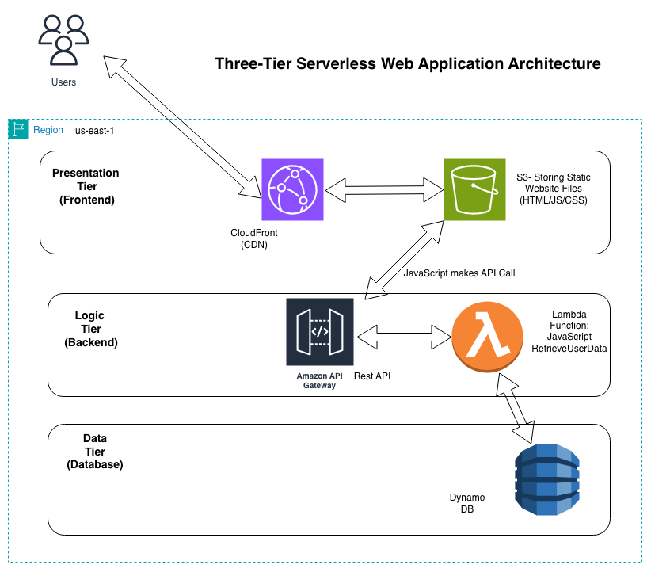

# three-tier-serverless-app
Full-stack serverless web application with S3/CloudFront frontend, Lambda/API Gateway backend, and DynamoDB database. Built to demonstrate cloud-native architecture and AWS service integration.


## Architecture



## Technologies Used

**Frontend:**
- S3 (Static website hosting)
- CloudFront (CDN for global distribution)
- HTML/CSS/JavaScript

**Backend:**
- API Gateway (RESTful API)
- Lambda (Serverless compute)
- JavaScript (Application logic)

**Database:**
- DynamoDB (NoSQL database)

**Security & Configuration:**
- Origin Access Control (OAC) for S3 bucket security
- CORS configuration for cross-origin requests
- IAM roles for Lambda execution

## Features

- Add new users via web form (CREATE)
- Retrieve and display user data (READ)
- Serverless architecture (no servers to manage)
- Global content delivery via CloudFront
- Secure S3 access using Origin Access Control
- Event-driven backend processing

## Architecture Details

### Three-Tier Design

1. **Presentation Tier (Frontend)**
   - Static website hosted on S3
   - Distributed globally via CloudFront CDN
   - Secured with OAC (Origin Access Control)

2. **Logic Tier (Backend)**
   - RESTful API built with API Gateway
   - Lambda functions handle business logic
   - Stateless, event-driven processing

3. **Data Tier (Database)**
   - DynamoDB for scalable NoSQL storage
   - On-demand capacity for cost optimization
   - Single-table design for user data

### Security Implementation

- **S3 Bucket:** Private, only accessible via CloudFront OAC
- **CORS Configuration:** Lambda returns proper CORS headers for browser requests
- **IAM Roles:** Least-privilege access for Lambda to DynamoDB
- **API Gateway:** Regional endpoint with throttling enabled

## Setup Instructions

### Prerequisites
- AWS Account
- AWS CLI configured
- Basic understanding of AWS services

### Deployment Steps

1. **Create DynamoDB Table**
```bash
   aws dynamodb create-table \
     --table-name UserData \
     --attribute-definitions AttributeName=userId,AttributeType=S \
     --key-schema AttributeName=userId,KeyType=HASH \
     --billing-mode PAY_PER_REQUEST
```

2. **Deploy Lambda Function**
   - Create Lambda function in AWS Console
   - Upload code from `backend/index.mjs`
   - Attach IAM role with DynamoDB permissions
   - Set timeout to 10 seconds

3. **Configure API Gateway**
   - Create REST API
   - Create resource and methods (GET, POST, PUT, DELETE)
   - Enable CORS
   - Deploy to stage (e.g., 'prod')

4. **Deploy Frontend**
   - Upload files from `frontend/` to S3 bucket
   - Enable static website hosting
   - Configure bucket for CloudFront OAC access

5. **Create CloudFront Distribution**
   - Set S3 bucket as origin
   - Configure Origin Access Control
   - Set default root object to `index.html`
   - Deploy and wait for distribution

6. **Update Frontend API Endpoint**
   - Edit `frontend/script.js`
   - Replace `API_ENDPOINT` with your API Gateway URL
   - Re-upload to S3

## Challenges & Solutions

### Challenge 1: CloudFront not serving updated files
**Solution:** Invalidated CloudFront cache using AWS Console

### Challenge 2: CORS errors when calling API from frontend
**Solution:** Configured Lambda to return proper CORS headers in response

### Challenge 3: S3 bucket security
**Solution:** Implemented Origin Access Control (OAC) to restrict direct S3 access, only allowing CloudFront

## What I Learned

- **Serverless architecture patterns** - Designing for stateless, event-driven processing
- **CloudFront configuration** - Understanding edge caching and origin access control
- **CORS troubleshooting** - Debugging cross-origin request issues
- **API Gateway integration** - Connecting frontend to backend via REST API
- **DynamoDB design** - NoSQL data modeling for user data storage

## Future Enhancements

- Add authentication (Cognito)
- Implement CI/CD pipeline for automated deployments
- Add CloudWatch monitoring and alarms
- Implement caching strategies
- Add input validation and error handling

## Project Timeline

Built over 2 weeks in December 2025 as part of AWS skills development.

